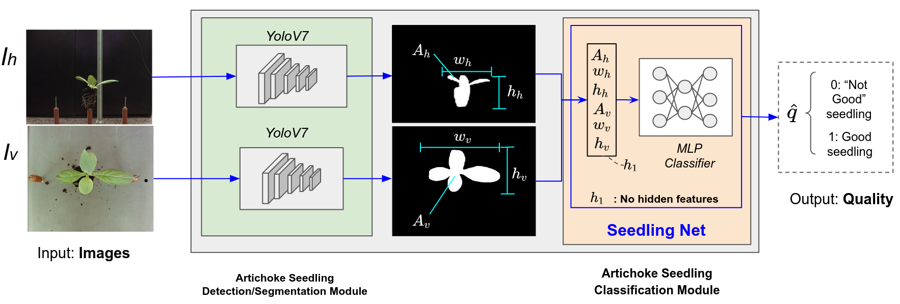

    <h1>Seedlingnator</h1>

  Computer vision system to classify artichoke seedlings in agroindustrial enviroments using YoloV7

  

    
  

<!-- 
## Installation & Testing:

### Installation

### Testing -->

### Publications:

1. Deep Learning-based Segmentation and Classification System for Artichoke Seedling Grading. INTERCON2023. (https://ieeexplore.ieee.org/document/10326060)

### To-do:

- [ ] Upload the weights of the models to google drive and create the bash file to download them
- [ ] Create a notebook to automate the training of the object detection model.
- [ ] Order the dataset used to train Yolov7 
